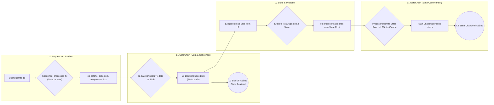

# 交易流程

Gate Layer 上的一笔交易，从提交到最终确认，其生命周期主要包含两个核心要求：

1.  **数据写入 L1**：交易数据必须被安全地发布到 **GateChain (L1)** 上，以确保数据的可用性 (Data Availability)。
2.  **状态在 L2 执行**：交易必须在 **Gate Layer (L2)** 的执行引擎 (`op-geth`) 中被处理，从而改变 L2 的状态。随后，一个对 L2 新状态的承诺 (Commitment) 必须被提交到 **GateChain (L1)**。

下面是这个过程的详细分解。

### 1. 写入交易至 GateChain (L1)

这个阶段主要由 **`op-batcher`** 组件负责。它的工作是将多笔 L2 交易打包、压缩，然后作为一个整体发布到 GateChain。

#### 数据压缩 (Compression)

`op-batcher` 会从 Sequencer (排序器) 收集一批交易，并将它们聚合到一个 `channel` 中。通过将多个批次的数据聚合在 `channel` 里，可以获得更高的数据压缩率，从而降低单笔交易的成本。

当一个 `channel` 满了或者超时后，它就会被压缩并准备发布。

#### 数据发布 (Posting to L1)

`op-batcher` 会将压缩后的数据发布到 **GateChain (L1)**。得益于 GateChain 对 EIP-4844 的支持，这些数据会作为 **`blobs`** 发布。这是一种成本极低的数据类型，专为 Rollup 设计，用于存储 L2 交易数据，从而极大地降低了 Gate Layer 用户的交易费用。

### 2. 交易状态 (Transaction States)

一笔 L2 交易在被最终确认前，会经历三种状态：

*   **`unsafe` (不安全)**：交易已被 L2 的 Sequencer 处理，但其数据尚未发布到 GateChain。它被称为“不安全”是因为交易数据仅存在于 Sequencer 中，尚未被发布到 L1。如果 Sequencer 在此阶段进行重组，该交易可能会被排序到不同位置甚至被丢弃。
*   **`safe` (安全)**：交易数据已经被打包并作为 `blob` 成功发布到 GateChain 的一个区块中。此时，交易数据已安全地记录在 L1 上。由于 GateChain 不会发生链重组，因此 `safe` 状态的交易数据不会丢失，但需要等待 L2 协议设定的最终确认期。
*   **`finalized` (最终确认)**：当包含 L2 交易数据的 GateChain 区块产生后，Gate Layer 系统会等待额外的 10 个 GateChain 区块被确认。这个由 L2 强制执行的安全等待期结束后，交易便达到 `finalized` 状态，此时它被认为是完全不可逆的。

### 3. 状态处理 (State Processing)

这个阶段分为两步：

#### 状态变更 (State Changes)

交易数据被发布到 GateChain 后，Gate Layer 的全节点会从 L1 读取这些数据，并在本地的 L2 执行引擎 (`op-geth`) 中执行它们。这个过程会改变 L2 的状态。

#### 状态根提案 (State Root Proposals)

**`op-proposer`** 组件会负责计算执行交易后 L2 的新状态根 (State Root)，并将这个状态根提交到部署在 **GateChain (L1)** 上的 `L2OutputOracle` 合约中。

这个提案并非立即生效，它必须经过一个**故障挑战期 (fault challenge period)**。只有在挑战期结束后且无人成功挑战，这个状态根才被认为是 L2 状态的最终承诺。

### Gate Layer 交易生命周期流程图

