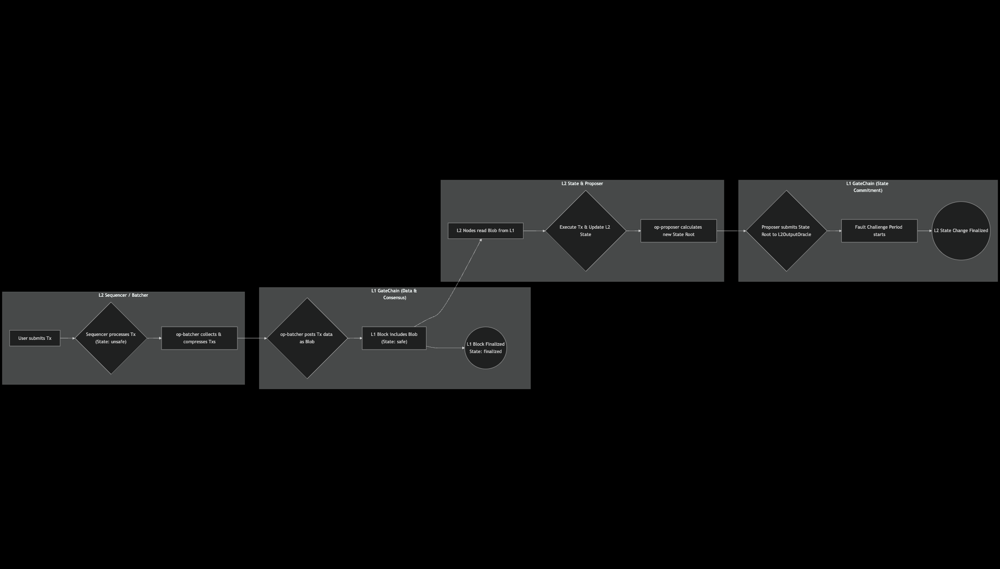

# Transaction Flow

A transaction on Gate Layer, from submission to final confirmation, involves two core requirements:

1.  **Data Posting to L1**: Transaction data must be securely posted to **GateChain (L1)** to ensure Data Availability.
2.  **State Execution on L2**: The transaction must be processed by the **Gate Layer (L2)** execution engine (`op-geth`), thereby changing the L2 state. Subsequently, a commitment to this new L2 state must be submitted to **GateChain (L1)**.

Here is a detailed breakdown of the process.

### 1. Posting Transactions to GateChain (L1)

This stage is primarily handled by the **`op-batcher`** component. Its job is to batch and compress multiple L2 transactions and then post them as a single unit to GateChain.

#### Compression

The `op-batcher` collects a batch of transactions from the Sequencer and aggregates them into a `channel`. Aggregating multiple batches in a channel achieves a higher data compression ratio, thus reducing the cost per transaction.

When a channel is full or times out, it is compressed and prepared for posting.

#### Posting to L1

The `op-batcher` posts the compressed data to **GateChain (L1)**. Thanks to GateChain's support for EIP-4844, this data is posted as **`blobs`**. This is an extremely low-cost data type designed specifically for rollups to store L2 transaction data, significantly reducing transaction fees for Gate Layer users.

### 2. Transaction States

An L2 transaction goes through three states before it is finalized:

*   **`unsafe`**: The transaction has been processed by the L2 Sequencer, but its data has not yet been posted to GateChain. It is called "unsafe" because the transaction data only exists on the Sequencer and has not yet been posted to L1. If the Sequencer reorganizes at this stage, the transaction could be reordered or even dropped.
*   **`safe`**: The transaction data has been batched and successfully published as a `blob` to a GateChain block. At this point, the data is securely recorded on L1. Since GateChain does not undergo reorgs, the data in a `safe` state will not be lost, but it must wait for the finality period defined by the L2 protocol.
*   **`finalized`**: After the GateChain block containing the L2 transaction data is produced, the Gate Layer system waits for an additional 10 GateChain blocks to be confirmed. Once this L2-enforced security waiting period is over, the transaction reaches the `finalized` state and is considered completely irreversible.

### 3. State Processing

This phase is divided into two steps:

#### State Changes

After the transaction data is posted to GateChain, Gate Layer's full nodes read this data from L1 and execute it in their local L2 execution engine (`op-geth`). This process alters the L2 state.

#### State Root Proposals

The **`op-proposer`** component calculates the new L2 state root after the transactions are executed and submits this state root to the `L2OutputOracle` contract deployed on **GateChain (L1)**.

This proposal does not take effect immediately. It must pass through a **fault challenge period**. Only after the challenge period ends without a successful challenge is the state root considered the final commitment to the L2 state.

### Gate Layer Transaction Lifecycle

**Key Points of the Diagram**

*   **User Submission & L2 Initial Processing**: Transactions are first received and processed by the L2 Sequencer, at which point their state is `unsafe`.
*   **Data Batching & L1 Posting**: The `op-batcher` collects multiple transactions into a batch and posts it as a Blob to GateChain (L1), transitioning the transaction state to `safe`.
*   **L1 Confirmation & L2 Finality**: After the GateChain block is confirmed and an additional L2-defined waiting period has passed, the transaction reaches the `finalized` state.
*   **State Root Proposal & Challenge**: Concurrently, the `op-proposer` calculates the new L2 state root and submits it to the `L2OutputOracle` contract on L1.
*   **Final State Commitment**: After passing a fault challenge period without a successful challenge, this state root becomes the final commitment to the L2 state, ensuring the final consistency of state changes.
