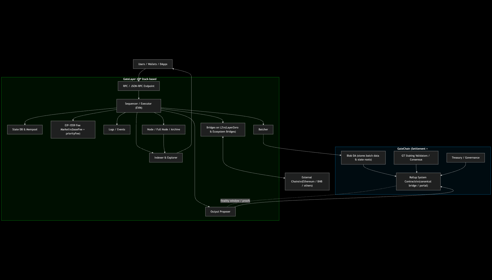
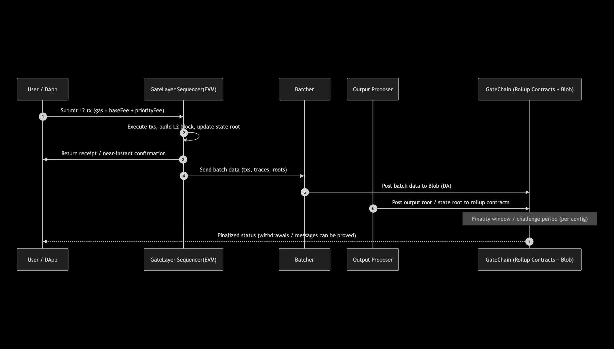
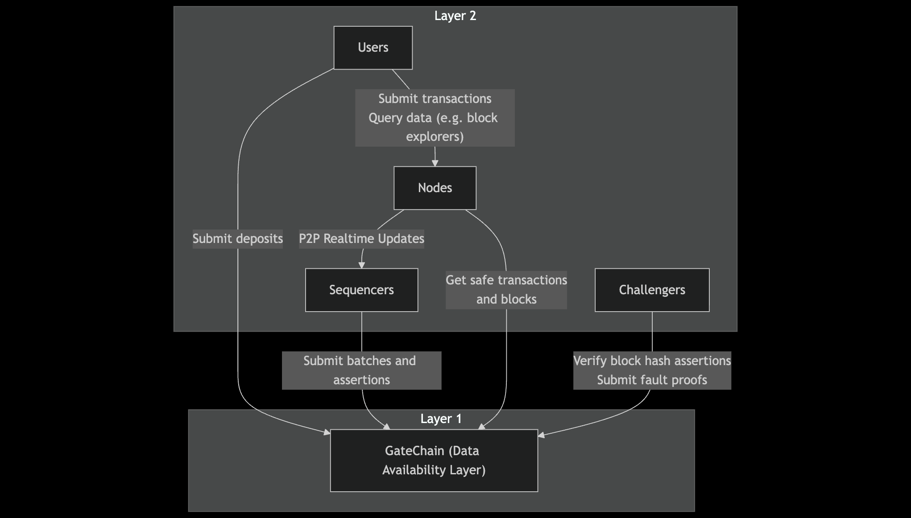

# Gate Layer × GateChain：技术架构

## 高层架构

下图展示了 Gate Layer 的高层技术架构，涵盖了从用户交互、L2 执行到 L1 结算与数据可用性的完整流程。它清晰地描绘了 Sequencer、Batcher、Proposer 等核心组件如何与 GateChain 上的 Rollup 合约及 Blob 存储协同工作，共同保障系统的安全、高效与可扩展性。

**图中要点**

*   **L2 执行**：Sequencer 在 EVM 上执行交易，形成 L2 区块；EIP-1559 负责 L2 费率调节。
*   **批量提交**：Batcher 将交易批次与**状态根**写入 **GateChain 的 Blob**（数据可用性层）。
*   **结算与最终性**：Proposer 把输出（state root / output root 等）提交到 GateChain 上的 Rollup 合约；在最终性窗口后确定。
*   **安全与治理**：结算安全由 **GT 质押 + 验证者网络**提供；治理/金库在 GateChain 侧。
*   **互操作**：在 L2 侧集成 **LayerZero** 与生态桥，提供跨链资产/消息互通。
*   **可用性与可观察性**：节点、索引、浏览器在 L2，读取 Blob/合约信息以实现可验证与回溯。
*   **EVM 兼容性与开发者体验**: Gate Layer 内核采用 EVM 执行引擎，与以太坊完全兼容。开发者可以无缝迁移 DApp 并使用 Hardhat、Remix 等标准工具链。
*   **模块化组件**: 架构分离了核心组件：**Sequencer** 负责交易排序，**Batcher** 负责数据打包，**Proposer** 负责状态根提案，提升了系统的可维护性。
*   **统一交互入口**: 所有链上交互均通过标准的 **RPC 端点**进入，为用户和开发者提供了与以太坊一致的交互体验。

---

## 交易与结算流程

本图通过时序图的形式，详细展示了一笔 L2 交易从提交到最终确认的全过程。它揭示了用户、Sequencer、Batcher、Proposer 以及 GateChain (L1) 之间的交互顺序，帮助理解交易状态如何从 `unsafe` 演变为 `finalized`。

---

## 组件交互图

此图聚焦于 Gate Layer 生态中不同角色（用户、节点、Sequencer、Challenger）与 L1、L2 之间的核心交互关系。它简化了内部复杂性，重点突出了数据流和职责划分，例如用户如何提交交易、Sequencer 如何向 L1 提交数据，以及节点如何从 L1 同步信息。

