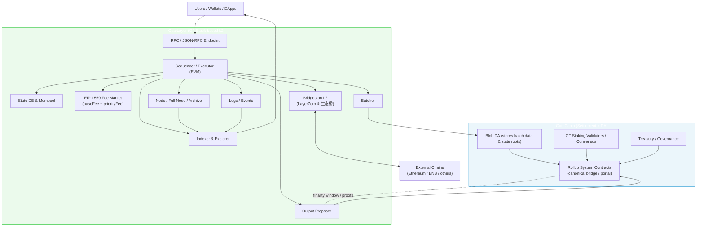
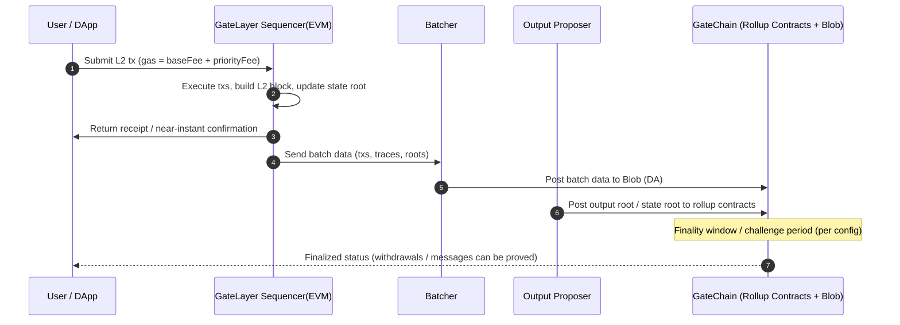
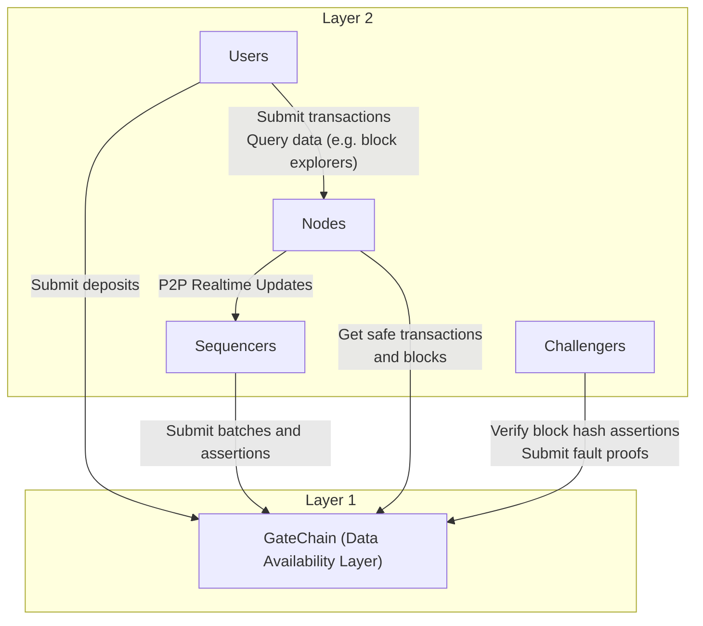

# GateLayer × GateChain：技术架构

## 高层架构

*请注意：下图是 Mermaid 格式的源码，我们推荐使用您提供的 SVG 矢量图版本以获得最佳显示效果。*

**图中要点**

*   **L2 执行**：Sequencer 在 EVM 上执行交易，形成 L2 区块；EIP-1559 负责 L2 费率调节。
*   **批量提交**：Batcher 将交易批次与**状态根**写入 **GateChain 的 Blob**（数据可用性层）。
*   **结算与最终性**：Proposer 把输出（state root / output root 等）提交到 GateChain 上的 Rollup 合约；在最终性窗口后确定。
*   **安全与治理**：结算安全由 **GT 质押 + 验证者网络**提供；治理/金库在 GateChain 侧。
*   **互操作**：在 L2 侧集成 **LayerZero** 与生态桥，提供跨链资产/消息互通。
*   **可用性与可观察性**：节点、索引、浏览器在 L2，读取 Blob/合约信息以实现可验证与回溯。

---

## 交易与结算流程

*请注意：下图是 Mermaid 格式的源码，我们推荐使用您提供的 SVG 矢量图版本以获得最佳显示效果。*

---

## 组件交互图

