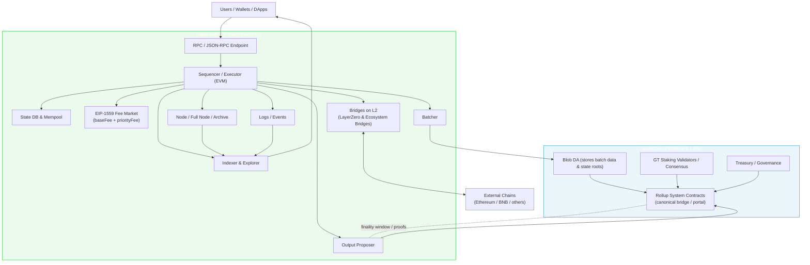
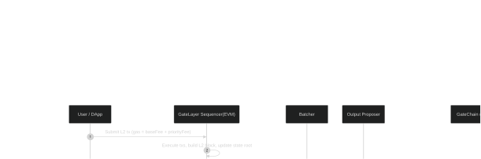
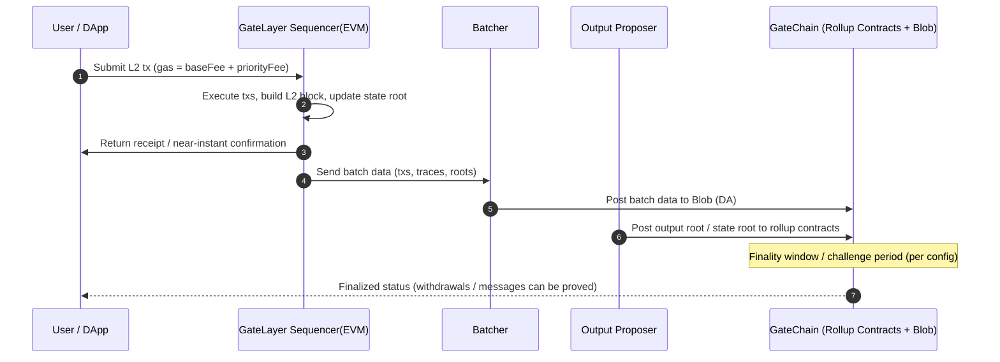
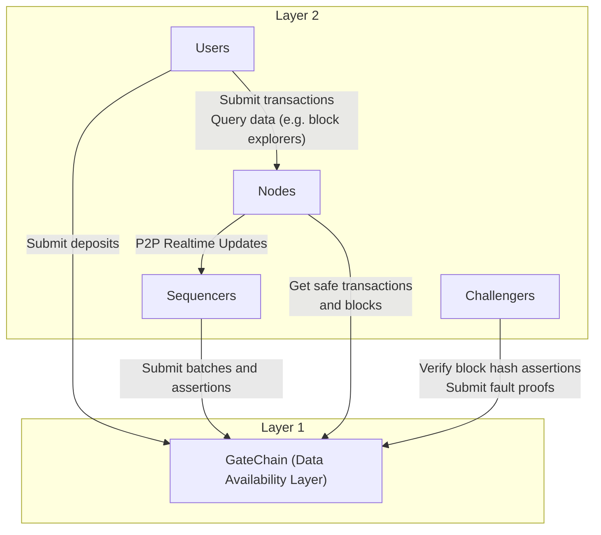

# GateLayer × GateChain: Technical Architecture

## High-Level Architecture

*Note: The diagram below is in Mermaid format. We recommend using the SVG version you provided for the best display quality.*

**Key Points of the Diagram**

*   **L2 Execution**: The Sequencer executes transactions on the EVM to form L2 blocks; EIP-1559 manages L2 fee adjustments.
*   **Batch Submission**: The Batcher writes transaction batches and **state roots** to **GateChain's Blobs** (Data Availability layer).
*   **Settlement & Finality**: The Proposer submits outputs (state root, output root, etc.) to the Rollup contracts on GateChain; finality is achieved after a finality window.
*   **Security & Governance**: Settlement security is provided by **GT staking + the validator network**; governance and the treasury reside on the GateChain side.
*   **Interoperability**: **LayerZero** and ecosystem bridges are integrated on the L2 side to enable cross-chain asset and message communication.
*   **Availability & Observability**: Nodes, indexers, and explorers on L2 read Blob/contract information to ensure verifiability and traceability.

---

## Transaction and Settlement Flow

*Note: The diagram below is in Mermaid format. We recommend using the SVG version you provided for the best display quality.*

---

## Component Interaction Diagram

